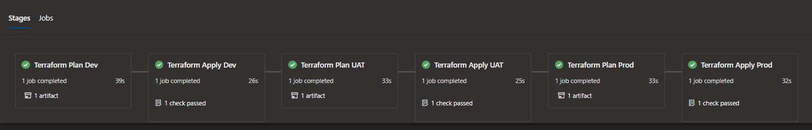

# Terraform with Azure Pipelines 
#### This Repository can be used as a starting point for deploying resources across multiple environments in Azure using Terraform & Azure Pipelines.

## Purpose
- Deploy resources accross multiple environments in Azure using one Terraform code base.
- Reduce deployment times.
- Reduce human error when deploying across multiple environments.
- Reduce code repetition.

## Contents: 
[/terraform/infrastructure](https://github.com/jfe7/azure-pipelines-terraform/tree/main/terraform/infrastructure) - Terraform Infrastructure Code.

[/terraform/infrastructure/environments](https://github.com/jfe7/azure-pipelines-terraform/tree/main/terraform/infrastructure/environments) - Terraform Variable Files For Each Environment.

[/terraform/pipeline](https://github.com/jfe7/azure-pipelines-terraform/tree/main/terraform/pipeline) - Terraform Stages Template YAML Pipeline & Azure Pipelines YAML 

## Template Usage

The Terraform Pipeline Template [/terraform/pipeline/terraform-stages-template.yml](https://github.com/jfe7/azure-pipelines-terraform/blob/main/terraform/pipeline/terraform-stages-template.yml) has three mandatory parameters that must be passed using [/terraform/pipeline/azure-pipelines.yml](https://github.com/jfe7/azure-pipelines-terraform/blob/main/terraform/pipeline/azure-pipelines.yml).

- terraformVersion - [version of Terraform to install on Build Agent, defaults to 0.14.5]
- resourceGroup - [name of Resource Group for Environment, this is only used to seperate terraform state files]
- environment - [determines which environment resources are deployed to / determines which .tfvars file is passed to Terraform to inject variables]

This template uses Environments in Azure DevOps, be sure to add approvers to the Environment in Azure DevOps, this results in the Pipeline needing approval to move onto the Terraform Apply Stage, this allows approvers to check the Terraform Plan output and make sure Terraform is going to create/update/delete the expected resources, once the approver is happy with the output, they can approve the stage, and allow the pipeline to move to the Terraform Apply Stage.
